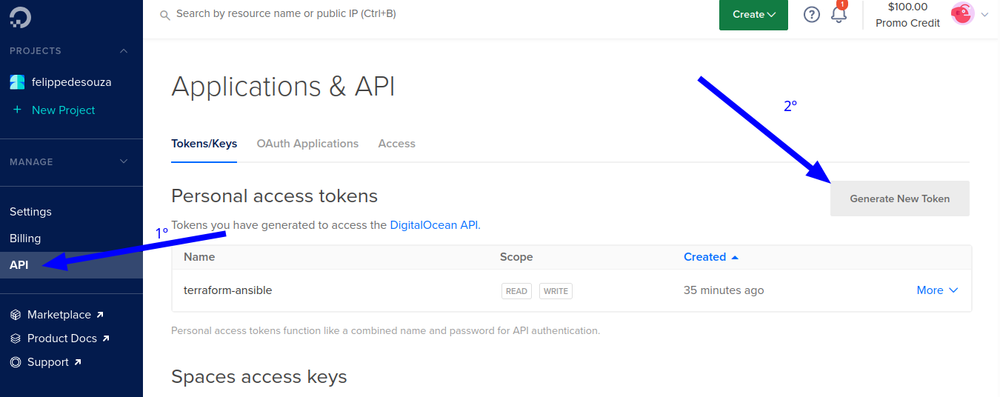
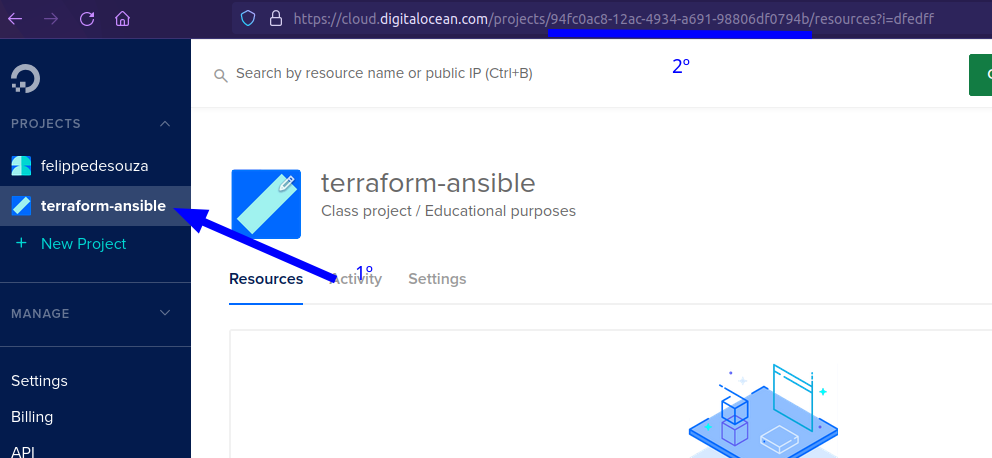
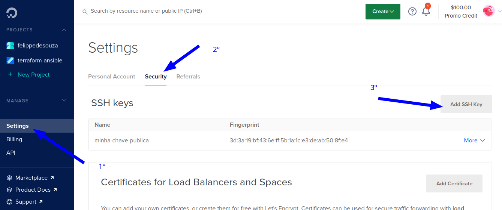
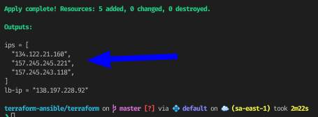

# Terraform

**Dica:** use o s3 da aws pra armazenar o '.tfstate'. quando algo na infra for modificado, o bucket do s3 tem que ser atualizado. assim o time de devs consegue usar a mesma infra.

## Como usar?

1. `cd terraform`
1. gere o token de acesso na digital ocean e coloque em `do_token` em `terraform.tfvars`

   

1. coloque o id do project em `project_id` em `terraform.tfvars`

   

1. execute o comando abaixo, pegue o id do ssh key e coloque no `pvt_key` do `terraform.tfvars`
   1. coloque o token gerado da digital ocean e troque abaixo

      ```bash
      curl -X GET \
      -H "Content-Type: application/json" \
      -H "Authorization: Bearer $DIGITALOCEAN_TOKEN" \
      "https://api.digitalocean.com/v2/account/keys"
      ```

   1. output:

      ```json
      {"ssh_keys":[{
         "id":31811118,
         "public_key":"asdhsadihiads.... @boibandido-Inspiron-5558\n",
         "name":"minha-chave-publica",
         "fingerprint":"3...0:8f:e4"}],
      "links":{"pages":{}},"meta":{"total":1}}
      ```

   1. id: 31811118

1. gere o par de chave publica e privada. A chave privada deve se guardada de forma segura, de preferencia em um pendrive e que fique escondido das pessoas.
   1. execute o  comando `ssh-keygen`. grave o passphrase, pois vai precisar dela pra encriptar a chave.
   1. a chave publica por padrao fica em `~/.ssh/id_rsa.pub` e a privada em `~/.ssh/id_rsa`

1. adicione a chave publica na digital ocean
   1. copie a chave publica com `cat ~/.ssh/id_rsa.pub` e cole quando pedir

      

1. execute `terraform apply`, os ips dos droplets, coloque no hosts em `../ansible/hosts`

   
